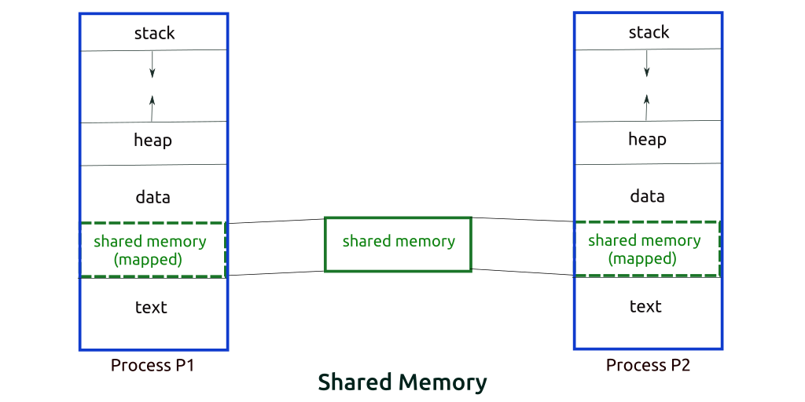
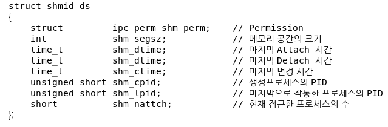

# 스케줄링 : 비례 배분

비례 배분의 개념은 간단하다. 반환 시간이나 응답 시간을 최적화하는 대신 스케줄러가 각 작업에게 CPU의 일정 비율을 보장하는 것이 목적이다.

비례 배분 스케줄링의 좋은 예는 `Waldspurger and Weihl` 의 연구다.

**추첨 스케줄링**으로 알려져 있다. 기본 아이디어는 간단하다.

- 다음 실행될 프로세스를 추첨을 통해 결정한다.
- 더 자주 수행되어야 하는 프로세스는 당첨 기회를 더 많이 준다.

> [!Note] > **핵심 질문 : 어떻게 CPU를 정해진 비율로 배분할 수 있는가**
>
> 특정 비율로 CPU를 배분하는 스케줄러를 어떻게 설계할 수 있는가?
>
> 그렇게 하기 위한 중요한 기법은 무엇인가? 그 기법은 얼마나 효과적인가?

## 12.1 기본 개념 : 추첨권은 당신의 몫을 나타낸다.

추첨권은 프로세스가 받아야 할 자원의 몫을 나타내는 데 사용된다.

- ex) A와 B 두 프로세스가 각각 75장, 25장의 추첨권을 가지고 있다면, A에게 75%의 CPU를, B에게 남은 25%를 할당하는 것이 목적이다.
- 추첨 스케줄링은 이러한 목적을 (타임 슬라이스가 끝날 때마다) 확률적으로 (하지만 결정적이지는 않게) 달성한다. 이를 위해,
  - 스케줄러는 전체 몇 장의 추첨권이 있는 지 알아야 한다.
  - 스케줄러는 추첨권을 선택한다.
- 무작위성은 원하는 비율을 정확히 보장하지는 않는다. 하지만 작업이 장시간 진행될 수록 원하는 비율을 달성할 가능성이 높아진다.
  - 추첨을 계속 반복하다보면 각 프로세스가 가진 추첨권의 개수 비율과 동일한 비율에 근접해갈 것이다.

## 12.2 추첨 기법

추첨권을 다루는 한 가지 기법은 **추첨권 화폐(ticket currency)** 의 개념이다.

- 이 개념은 사용자가 자기의 화폐 가치로 추첨권을 자유롭게 할당할 수 있도록 허용한다.
  - ex) A, B에게 각각 100장의 추첨권이 주어졌다.
    - A는 자신이 정한 화폐로 A1, A2 프로세스에 전체 1000장 중 각각 500장 씩을 할당했다.
    - B또한 자신이 정한 화폐로 하나의 프로세스에 10장 중 10장을 할당하였다.
    - 이 경우, 시스템은 A의 몫을 1000→100으로 변환하여 A1, A2에 각각 50장 씩 할당한 것으로 계산하고, B의 경우 10→100으로 변환하여 B의 프로세스에 100장의 추첨권을 할당한 것으로 계산한다.

다른 유용한 기법으로는 **추첨권 양도(ticket transfer)**다.

- 양도를 통해 프로세스는 일시적으로 추첨권을 다른 프로세스에게 넘겨줄 수 있다. 이 기능은 클라이언트/서버 환경에서 특히 유용하다.
- 클라이언트 프로세스는 서버에게 메시지를 보내 자신을 대신해 특정 작업을 해달라고 요청한다.
  - 작업이 빨리 완료될 수 있도록 클라이언트는 서버에게 추첨권을 전달하고 서버가 자신의 요청을 수행하는 동안 서버의 성능을 극대화하려고 한다.
  - 요청을 완수한 후 서버는 추첨권을 다시 클라이언트에게 되돌려 준다.

마지막으로 **추첨권 팽장(ticket inflation)** 도 유용하게 사용된다.

- 프로세스는 일시적으로 자신이 소유한 추첨권의 수를 늘이거나 줄일 수 있다.
  - 서로 신뢰하지 않는 프로세스들이 상호 경쟁하는 시나리오에서는 의미가 없다.
  - 하나의 욕심 많은 프로세스가 많은 양의 추첨권을 자신에게 할당해 CPU를 장악할 수도 있기 때문.
- 어떤 프로세스가 더 많은 CPU 시간을 필요로 한다면, 시스템에게 이를 알리는 방법으로 다른 프로세스들과 통신하지 않고 혼자 추첨권의 가치를 상향 조정한다.

## 12.3 구현

추첨 스케줄링의 가장 큰 장점은 구현이 단순하다는 것이다.

필요한 것은 **난수 발생기**, **프로세스들의 집합을 표현할 자료구조, 추첨권의 전체 개수** 뿐이다.

구현 방법은 간단하다.

1. `0 ~ 전체 추첨권 수` 의 수 중 랜덤하게 당첨 숫자를 추첨한다.
2. 프로세스 리스트를 순회한다.
3. 각 순회 당, 프로세스의 추첨권 수를 누적해서 더해나간다.
4. 누적한 숫자가 당첨 숫자보다 커지면 반복을 중지한다.
5. 반복이 중지된 시저미의 프로세스가 당첨된 프로세스이다.

이 방법은, 일반적으로 리스트를 내림차순으로 정렬하면 가장 효율적이다. 정렬 순서는 알고리즘의 정확성에 영향을 주지 않지만 검색 횟수는 최소화시킬 수 있다.

## 12.4 예제

추첨 스케줄링의 동작을 쉽게 이해하기 위해 예를 들어보자.

- CPU를 공유하는 두 개의 작업 A, B가 있다.
- A와 B는 같은 개수의 추첨권(100)을 가지고 있으며, 동일한 실행 시간을 갖는다.
- 우리는 A와 B를 동시에 종료시키고자 한다.
  - 하지만 추첨 스케줄링의 무작위성으로 한 작업이 다른 작업보다 먼저 종료될 수 있다.
  - 이 차이를 정량화하기 위해, 간단한 불공정 지표인 U를 정의한다.
    - U : 첫 번째 작업이 종료된 시간 / 두 번째 작업이 종료된 시간
    - 즉, 완벽한 공정 스케줄러에 가까울 수록 U는 1에 수렴한다.
- 위와 같은 세팅으로 추첨 스케줄링을 여러번 실행시켰을 때, 작업이 충분한 기간 동안 실행되어야 추첨 스케줄러가 원하는 결과에 가까워짐을 확인할 수 있다.

## 12.5 추첨권 배분 방식

그렇다면, 작업들에게 추첨권을 몇 개씩 분배해야 할까? 시스템 동작이 추첨권 할당 방식에 따라 크게 달라지기 때문에 상당히 어려운 문제다.

한 가지 접근 방식은, **사용자가 가장 잘 알고 있다고 가정하는 것**이다. 각 사용자에게 추첨권을 나눠준 후 사용자가 알아서 실행시키고자 하는 작업들에 추첨권을 배분하는 것이다.

- 하지만 이는, 여전히 결과적으로는 어떤 작업을 우선해야 하는 지 전혀 제시하지 못하기 때문에, 해결책이 아니다.

## 12.6 왜 결정론적 방법을 사용하지 않는가

위에서 본 바와 같이 무작위성을 이용하면 스케줄러를 단순하게 만들 수 있지만, 정확한 비율을 보장할 수 없다. 짧은 시간만 실행되는 경우는 더 그렇다.

- 이런 이유로, Waldspurger는 결정론적 공정 배분 스케줄러인 **보폭 스케줄링**을 고안했다.

### 보폭 스케줄링이란?

- 시스템의 각 작업은 보폭을 가지고 있다.
- 보폭은 자신이 가지고 있는 추첨권 수에 반비례하는 값이다.
  - 예를 들어 프로세스 A, B, C가 각각 100, 50, 250의 추첨권을 가졌을 경우,
  - 이를 10000이라는 임의의 수로 나누면 각 **100, 200, 40**이 된다. 이 수가 곧 보폭(stribe)이 된다.
  - 프로세스가 실행될 때마다 pass라는 값을 보폭만큼 증가시켜 얼마나 CPU를 사용했는지를 추적한다.
  - 스케줄러는 보폭과 pass값을 사용하여 어느 프로세스를 실행시킬 지 결정하며, 가장 작은 pass 값을 가진 프로세스를 선택한다.
- 이 방법의 보폭 스케줄링을 사용하면, 결과적으로 실행 횟수가 각 프로세스가 가진 추첨권의 개수와 정확하게 비례하게 된다. 각 스케줄링 주기마다 정확한 비율로 CPU를 배분하기 때문이다.

### 그렇다면, 왜 추첨 스케줄링을 사용하는가?

추첨 스케줄링은 보폭 스케줄링에는 없는 몇 가지 장점을 갖고 있다.

- 상태 정보가 필요 없다.
  - 보폭 스케줄링은 작업 처리 중 새 작업이 할당될 경우, 이 작업의 pass 값이 다른 작업들의 pass를 따라잡을 때까지 해당 작업이 CPU를 독점하는 문제가 발생할 수 있다.
  - 하지만 추첨 스케줄링은 프로세스 상태(CPU 사용 현황, pass 값 등)를 유지할 필요가 없다.
  - 새 프로세스가 추가되면 해당 프로세스가 가진 추첨권 개수와 전체 추첨권 개수만 갱신해 스케줄링하면 되기 때문이다.
- 위의 이유로, 추첨 스케줄링은 새 프로세스를 쉽게 추가할 수 있다.

## 요약

보폭 스케줄링은 개념은 흥미롭지만 CPU 스케줄러로서 널리 사용되고 있지는 않다. 접근 방식이 특히 입출력과 맞물렸을 때 제대로 동작하지 않기 때문이다.

또한, 추첨권 할당이라는 어려운 문제가 아직 미해결 상태로 남아있다. 범용 스케줄러는 그러한 문제를 더 직관적으로 해결하고, 때문에 더 널리 사용된다.

---

# 발표 주제 : IPC - 프로세스 간 통신 방법

프로세스는 완전히 독립된 실행 개체고, 각 프로세스마다 독립된 가상 메모리를 갖는다. 따라서 프로세스는 다른 프로세스에게 영향을 주거나 영향을 받지 않는다. → 프로세스 간 데이터 송수신의 어려움

이를 위해 커널 영역은 IPC라는 내부 프로세스 간 통신을 제공한다. `Inter-Process Communication`의 줄임말로 프로세스 간에 데이터 및 정보를 주고받기 위한 매커니즘이다.

프로세스는 이 IPC 기법을 사용해서 프로세스 간 통신을 할 수 있게 된다.

데이터를 공유하는 방법은 크게 두 가지다.

## 공유 메모리 (Shared Memory)

- 프로세스 간 공유가 되도록 설정해 놓은 메모리. 둘 이상의 프로세스가 같은 메모리 영역을 접근하여 데이터를 공유할 수 있다.
  
- 리눅스/유닉스 계열은 프로세스가 커널에게 공유 메모리를 요청하면, 커널은 공유 메모리 세그먼트를 할당시켜준 후 내부 자료구조를 통해 이러한 공유 메모리들을 관리한다.
  - 이 자료 구조는 `shmid_ds`라는 구조체에 의해 관리되며 `shm.h`에 정의돼있다.
    
  - 반면 윈도우는 유닉스처럼 `shmid_ds` 같은 구조체를 외부에 노출하지 않고, 대신 핸들 기반 객체 모델을 쓴다.
    - `CreateFileMapping` → 공유 메모리 객체 생성
      - 커널 메모리에 생성하는 건 동일. 이 객체 단위로 공유 메모리를 관리.
      - 공유 메모리 객체를 제어할 수 있는 핸들 반환해준다. (즉, 공유 메모리 자료구조가 캡슐화)
    - `OpenFileMapping` → 기존 공유 메모리에 attach.
    - `MapViewOfFile` → 현재 프로세스의 가상 주소 공간에 매핑.
- 리눅스에서 공유 메모리를 사용하기 위한 주요 시스템 콜은 `shmget`, `shmat`, `shmdt`, `shmctl` 등이다. 이러한 시스템 콜을 사용해 공유 메모리 세그먼트를 생성, 접근, 탈착, 제어할 수 있다.

  - shmget : 공유 메모리 키 값으로 세그먼트를 생성하거나 이미 만들어진 세그먼트에서 식별자 ID를 반환
    - `int shmid = shmget(key, size, IPC_CREAT | 0666);`
    - IPC_CREATE :
  - shmat : 생성된 공유 메모리 세그먼트를 현재 프로세스의 가상 주소 공간에 붙임(attach)
    - `shm_ptr = shmat(shmid, NULL, 0);`
    - 현재 프로세스의 가상 주소공간에 attach한 후, 그 주소 공간의 시작 주소를 반환.
    - 이후 해당 주소를 통해 데이터를 읽고 쓸 수 있음.
  - shmdt : 공유 메모리 세그먼트를 더 쓰지 않음을 알림 (현재 프로세스에서 공유 메모리 세그먼트 분리)
  - shmctl : 공유 메모리 제어. 보통 IPC_RMID 상수를 넘겨 마지막 프로세스 종료 후 메모리 해제하는 역할. (해당 명령어로 삭제 안해주면 재부팅 전까지 계속 남아있는다.)
  - 코드 예시 (타 블로그 발췌)

    ```java
    // 코드 출처 : https://wikidocs.net/231840

    #include <stdio.h>
    #include <stdlib.h>
    #include <string.h>
    #include <sys/ipc.h>
    #include <sys/shm.h>
    #include <sys/types.h>

    int main() {
        int shm_id;
        key_t key = 1234; // 공유 메모리 키
        char *shm_ptr;

        // 공유 메모리 세그먼트 생성
        shm_id = shmget(key, 1024, IPC_CREAT | 0666);
        if (shm_id < 0) {
            perror("shmget");
            exit(1);
        }

        // 공유 메모리 세그먼트를 현재 프로세스의 주소 공간에 첨부
        shm_ptr = shmat(shm_id, NULL, 0);
        if (shm_ptr == (char *) -1) {
            perror("shmat");
            exit(1);
        }

        // 공유 메모리에 데이터 쓰기
        printf("Enter some text: ");
        fgets(shm_ptr, 1024, stdin);

        printf("Written to shared memory: %s\n", shm_ptr);

        // 프로세스가 공유 메모리 세그먼트를 더 이상 사용하지 않음을 시스템에 알림
        shmdt(shm_ptr);

        return 0;
    }
    ```

- IPC 기법 중 하나인 세마포어(Semaphores)는 자원 동기화와 상호 베제를 보장하기 위해 쓰인다.

## 메시지 전달 (Message Passing)

- 공유 자원이 필요한 시점에 자원을 전달하는 방식
- 커널 메모리 영역에 메시지 전달을 위한 채널을 만들어서, 협력하는 프로세스들 사이에 메시지 형태로 정보를 send/receive.
- 복사 → 붙여넣기 방식으로 보면 된다. (이 이유로 공유 메모리에 비해 느리다.)
- 파이프, 시그널, 메시지 큐, 소켓 등의 기법이 메시지 전달 기법을 따른 것이다.
  

### 메시지 전달의 두 가지 모델

- Direct Communication (직접 통신)
  - 통신하려는 프로세스의 이름을 명시적으로 표시하여 메시지를 직접 전달. 송신 프로세스는 수신 프로세스의 이름을 알고 있어야 함.
  - 프로세스 간 링크는 유일하며, 대부분 양방향으로 구성됨.
  - A→B 로 메시지를 전달할 경우, A프로세스가 커널에게 직접 메시지를 전달한 후, 커널이 B 프로세스에게 해당 메시지를 전달하는 방식.
- Indirect Communication (간접 통신)
  - mailbox를 통해 메시지를 간접 전달하는 방식
  - 다대다 관계 가능.
  - A→B 로 메시지를 전달할 경우, 커널 내부 mail box에 메시지를 저장해 놓고, B프로세스가 해당 포트에 접근해 메시지를 가져가는 방식

### mail box(Message Box)란?

- 운영체제가 커널 내부에 만들어주는 논리적인 메시지 저장소
- 운영체제 이론에서 간접 통신을 설명할 때 ‘mailbox라는 중간 객체가 있다’ 라고 주로 가정함.
- 사용하는 IPC 기법에 따라 종류가 달라진다. (실제 구현에 따라 다르다는 뜻)
  - message Queue 방식에서는 message Queue, 소켓 방식에서는 소켓 객체(?, 내부에 버퍼가 있다고 함) , 파이프 방식에서는 파이프 버퍼가 해당 모델의 mailbox다.

## 출처

https://dar0m.tistory.com/233

https://dokhakdubini.tistory.com/490

https://y-oni.tistory.com/entry/%EC%89%AC%EC%9A%B4-%EC%84%A4%EB%AA%85-IPCInter-Process-Communication%EB%9E%80

https://steady-coding.tistory.com/508#google_vignette

https://wikidocs.net/231840

https://whatdocumentary.tistory.com/24

https://coding-chobo.tistory.com/16
