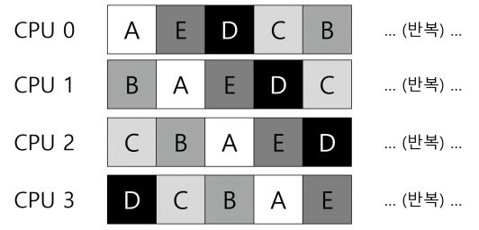
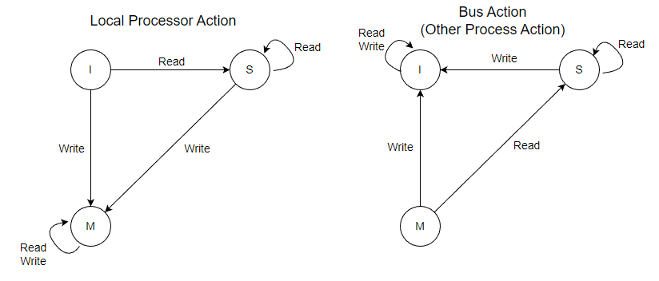

멀티 프로세서 시스템은 여러 캐의 CPU 코어가 하나의 칩에 내장된 멀티코어 프로세서로 인해 대중화되었다.

전통적인 프로그램은 오직 하나의 CPU만 사용하므로, 멀티 코어 프로세스를 사용해도 빨라지지 않는다. 이를 해결하려면 프로그램 자체를 병렬로 실행되도록 다시 작성해야 한다.

- 보통 스레드를 이용한다.

단일 프로세서 스케줄링의 많은 아이디어들을, 멀티 프로세서 시스템에서 동작하도록 어떻게 확장할 수 있을까?

> [!Note]
> 여러 CPU에 작업을 어떻게 스케줄해야 할까?
> 운영체제는 어떻게 작업을 여러 CPU에 스케줄해야 하는가? 어떤 새로운 문제가 등장하는가? 예전 기술을 적용할 것인가, 아니면 새로운 아이디어가 필요한가? 등

## 13.1 배경 : 멀티 프로세서 구조

단일 프로세서 구조와 멀티 프로세서 구조 간에는 다수 프로세서 간에 데이터 공유, 그리고 하드웨어 캐시 사용 방식에서 근본적인 차이가 발생한다.

1. 단일 프로세서 환경에서는

단일 CPU 시스템에는 하드웨어 캐시 계층이 존재한다. 이 캐시는 프로그램을 빠르게 실행하기 위해 존재한다. 캐시는 메인 메모리에서 자주 사용되는 데이터의 복사본을 저장하는 작고 빠른 메모리다.

캐시는 지역성에 기반한다. 지역성에는 시간 지역성과 공간 지역성 두 종류가 있다.

- 시간 지역성 : 데이터가 한 번 접근되면 가까운 미래에 다시 접근되기 쉽다는 아이디어
- 공간 지역성 : 프로그램이 주소 x의 데이터를 접근하면, x 주변의 데이터가 접근되기 쉽다는 아이디어.

1. 하지만 멀티 프로세서 환경에서는 문제가 발생한다.

- 캐시 일관성 문제 : 멀티 프로세서 시스템에서 프로세서 A가 프로세서 B의 캐시가 복사하고 있는 데이터를 변경했을 경우, 프로세서 B는 향후 해당 데이터를 사용할 때 변경 이전에 저장해둔 캐시의 데이터를 사용하게 되는 문제점.
- 해결책 :
  - 하드웨어는 메모리 주소를 계속 감시하고, 항상 제대로 된 상황만 발생토록 시스템을 관리.
  - 버스 기반 시스템에서는 버스 스누핑이라는 오래된 기법을 사용.
  - 자신과 메모리를 연결하는 버스의 통신 상황을 계속 모니터링. 캐시 데이터에 대한 변경이 발생하면 자신의 복사본을 무효화시키거나 갱신한다.

## 13.2 동기화를 잊지 마시오

하지만 캐시가 메모리 유지를 담당하더라도 ‘병행성’ 문제는 여전히 존재한다.

병행성 문제는 락(lock)을 사용하여 올바르게 동작시킬 수 있지만, CPU의 개수가 증가할수록 동기화된 자료 구조에 접근하는 연산은 매우 느려진다.

## 13.3 마지막 문제점 : 캐시 친화성

- 캐시 친화성 : 하나의 프로세스는 계속 같은 CPU에서 담당하는게 효율적이라는 속성. 프로세스 실행 시 필요한 데이터들이 CPU의 캐시에 적재될텐데, 이후 해당 프로세스를 다른 CPU에서 실행하게 되면 캐시를 다시 탑재해야해서 속도가 느려진다.
  - 하드웨어의 캐시 일관성 프로토콜 덕에 작동은 정상적으로 될 테지만, 성능을 위해 멀티 프로세서 스케줄러는 스케줄링 시 캐시 친화성을 꼭 고려해야 한다.
  - 가능한 한 한 프로세스를 동일한 CPU에서 실행하려고 노력하는 방향으로.

이제 멀티 프로세서 시스템의 스케줄러 개발 방법에 대해 논의해본다.

## 13.4 단일 큐 스케줄링

가장 기본적인 방식은 단일 프로세서 스케줄링의 기본 프레임워크를 그대로 사용하는 것이다.

- 이 정책의 장점은 단순함. 기존 정책을 다수 CPU에서 동작하도록 하는 데 많은 변경이 필요치 않다. 예를 들어 CPU가 2개라면 실행할 작업 두 개를 선택한다.
- 하지만 첫 번째 문제 : 확장성이 결여된다는 단점이 있다.
  - SQMS는 스케줄러가 다수의 CPU에서 제대로 동작하게 하기 위해 코드에 일정 형태의 락을 삽입한다. 락은 SQMS 코드가 단일 큐에 접근할 때 올바른 결과가 나오도록 한다.
  - 하지만 락은 성능을 크게 저하시킬 수 있고, 시스템의 CPU 개수가 증가할수록 더욱 그렇다.
    - 단일 락에 대한 경쟁이 증가할수록 시스템은 락에 점점 더 많은 시간을 소모하게 되고 실제 필요한 일에 쓰는 시간은 줄어든다.
- 두 번째 문제 : 캐시 친화성
  - 여러 개의 작업을 여러 개의 CPU에 단순 분배할 경우 작업 스케줄은 다음과 같다. 딱 봐도 캐시 친화성 관점에서 좋지 못하다.
    
  - SQMS 스케줄러는 위의 문제를 해결하기 위해 가능한 한 프로세스가 동일한 CPU에서 재실행될 수 있도록 시도한다.
    - 특정 작업들은 캐시 친화성을 고려하여 스케줄링하고, 다른 작업들은 오버헤드를 균등하게 하기 위해 여러 군데로 분산시키는 정책.
    - 하지만 이러한 방식은 구현이 복잡하다.

Q. SQMS가 캐시 친화성은 해결됐는데, 해결된 방식은 구현 난이도가 높아서 비효율적이라는.. 뜻인건가?

## 13.5 멀티 큐 스케줄링

CPU마다 작업 큐를 하나씩 두는 방식이다. 이러한 방식을 멀티 큐 멀티프로세서 스케줄링이라고 부른다.

MQMS에서 기본적인 스케줄링 프레임워크는 여러 개의 스케줄링 큐로 구성된다.

작업이 시스템에 들어가면 하나의 스케줄링 큐에 배치된다. 그 후에는 각각이 독립적으로 스케줄되기 때문에, 단일 큐 방식에서 보았던 정보의 공유 및 동기화 문제를 피할 수 있다.

MQMS가 SQMS에 비해 가지는 명확한 이점은 확장성이 좋다는 것이다.

- CPU 개수가 증가할수록, 큐의 개수도 증가하므로 락과 캐시 경합(cache contention)은 더이상 문제가 되지 않는다.
- 또한, MQMS는 같은 작업이 같은 CPU에서 계속 실행되기 때문에 본질적으로 캐시 친화적이다.

하지만 문제점 또한 명확하다.

- MQMS 방식의 근본적인 문제는 **워크로드의 불균형**이다.
  - 이를 해결하기 위해 **이주(Migration)** 기술이 있다.
  - 이주는 한 CPU에서 다른 CPU로 작업을 이주시킴으로써 워크로드의 균형을 달성하는 기술이다.

### 이주(Migration)

Q0, Q1 두 개의 작업 큐가 있다고 가정하자. Q0은 비어있고, Q1에 두 개의 작업이 배치되어있다면 이주 방식은 아주 간단하다. Q1에서 Q0으로 하나의 작업을 보내주면 된다.

하지만 Q0, Q1에 각각 1개, 2개의 작업이 배치되어 있는 경우는 좀 더 까다롭다. 이 경우는, 작업들을 지속적으로 이주시킴으로써 문제를 해결해야 한다.

- 이 ‘작업들을 지속적으로 이주’ 시키는 방법은 아주 다양한 패턴이 존재한다. 한 가지 기본적인 접근 방식은 **작업 훔치기**이다.
- 작업 훔치기는 작업의 개수가 낮은 큐가 가끔 다른 큐에 훨씬 많은 수의 작업이 있는지를 검사한다. 대상 큐가 소스 큐보다 더 가득 차 있다면 워크로드 균형을 맞추기 위해 소스는 대상에서 하나 이상의 작업을 가져온다.
  - 하지만 큐를 너무 자주 검사하게 되면 높은 오버헤드로 확장성에 문제가 생긴다.

## 13.6 Linux멀티 프로세서 스케줄러

Linux 커뮤니티에서는 멀티프로세서 스케줄러를 위한 단일화된 방식이 존재하지 않았다.

세 가지 스케줄러가 등장했다. : O(1) 스케줄러, Completely Fair Scheduler(CFS), BF 스케줄러 (BFS)

- O(1)과 CFS는 멀티 큐를, BFS는 단일 큐를 사용한다.
  - O(1) 스케줄러는 우선순위 기반 스케줄러로서 프로세스의 우선순위를 시간에 따라 변경하여 우선순위가 가장 높은 작업을 선택해 다양한 목적을 만족시킨다.
  - CFS는 결정론적 비례배분 방식이다.
  - BFS는 셋 중 유일한 단일 큐 방식이며 비례배분 방식이다. 하지만 EEVDF라고 알려진 더 복잡한 방식에 기반을 둔다.

---

# 발표 자료 : 스누핑 프로토콜의 세 가지 모델

캐시 일관성을 유지하기 위한 방법으로는 하드웨어적 방법, 소프트웨어적 방법이 존재한다.

- 소프트웨어적 방법 : 컴파일러가 캐시 일관성을 관리하게 함
- 하드웨어적 방법 : 프로세서나 캐시가 값이 변경됨을 알리거나(Broadcast), 디렉토리를 만들어 관리

## 스누핑 프로토콜

캐시 일관성을 유지하기 위한 방법 중에서도 하드웨어적 방법, 그 중에서도 Broadcase 하는 방법에 속한다. 프로세서가 캐시에 데이터를 쓸 때마다 bus로 브로드캐스트한다.

각 프로세서(캐시)는 bus를 관찰(snoop)하고 있다가 캐시에 저장돼있는 data에 대한 동작을 감지하면 이와 관련된 동작을 수행한다.

- 한 캐시에 있는 data에 변경이 일어남
- 이 캐시에서 bus를 통해 변경이 일어났다고 신호가 발생(broadcast)
- 신호가 발생한 캐시를 snooping 중이었던 다른 캐시들이 적절하게 action
  - update : 다른 캐시들의 동일 블록도 즉시 동일하게 변경하는 방법. 해당 data가 자주 변경되지 않는 경우 효율적이지만, 변경이 잦을 수록 bus에 많은 부담을 준다. (변경이 발생할 때마다 신호와 함께 snooping 중인 모든 캐시에 변경된 새 데이터를 보내주어야 하기 때문에)
    - write through policy 는 최신 데이터를 메인 메모리에 즉시 반영하겠다는 개념이다.
  - invalidate : 최신 데이터를 일단 현재 캐시 블록에서만 가지고 있는 방법. 대신 다른 캐시들의 블록을 유효하지 않게 만들어서 해당 캐시 블록이 최신값임을 보장한다. 변경이 발생할 경우 신호만 보내면 되므로 update에 비해 bus 부담이 적다.
    - write back policy 는 최신 데이터를 메인 메모리에 필요한 시기에 반영하겠다는 개념이다.

이처럼 간단하고 빠르지만 몇 가지 단점이 있다.

- 프로세서 수와 캐시 엑세스가 증가함에 따라 버스가 병목 현상이 될 수 있다.
- 이 프로토콜은 모든 캐시가 버스를 지속적으로 모니터링해야 하므로 적지 않은 비용이 발생한다.
- 버스가 네트워크로 대체되는 분산 시스템에서는 적합하지 않다.

하지만 제한된 수의 프로세서를 갖춘 소규모 멀티 프로세서 환경과 공유 데이터에 대한 저지연 액세스가 중요한 실시간 시스템에서는 유용하게 사용될 수 있을 것이다.

### MSI Protocol

Bus snooping 방법 중 invalidate 방식을 사용하는 대표적인 스누핑 프로토콜이다.

MSI protocol에는 세 가지 상태가 존재한다. 초기에는 모든 블록이 I 상태로 초기화 된다.

1. M (Modified) : 변경이 이루어진 현재 캐시에서만 데이터가 변경된 상태
   - (독점적. 메인 메모리와 값이 다르다. 최신 값이다.)
2. S (Shared) : bus를 통해 신호가 전달되어 다른 위치의 캐시에도 같은 값이 존재하는 상태
   - (메인 메모리와 값이 동일. 최신 원본 상태다.)
3. I (Invalidate) : data가 유효하지 않은 상태

캐시는 다른 bus를 snoop하고 있으므로, 신호가 들어오는 경우와 나가는 경우의 두 가지 케이스가 존재한다.

1. Local Processor Action (Bus에서 신호가 나가는 경우)

- 캐시가 속해있는 프로세서에서 read나 write 동작이 일어나는 경우에는, 다른 캐시들에게 신호를 브로드캐스트 해야 한다.
- I 상태에서 write 동작이 발생했을 경우
  - 현재 캐시 값이 유효하지 않다는 신호(write-miss)가 발생한다. 다른 캐시 블록들을 모두 invalid 처리하라는 신호 발생
  - 현재 캐시 블록을 snoop 하고 있는 다른 캐시들 중 동일 블록에 대해 M 상태인 캐시가 있다면, 해당 블록을 write-back 한 후 I 상태가 된다. (S 상태인 캐시들은 모두 I가 된다.)
  - 현재 캐시는 메인 메모리에서 블록을 복사해온 후 값을 write한다. 이후 M 상태가 된다.
  - 만약 snoop 중인 캐시들 중 동일 블록에 대해 M 상태인 캐시가 없다면 메인 메모리에서 바로 가져와 수정한다.
- I 상태에서 read 동작이 발생했을 경우
  - 현재 캐시 값이 유효하지 않다는 신호(read-miss)가 발생한다. 다른 캐시 블록들을 모두 invalid 처리하라는 신호 발생
  - 다른 캐시가 해당 data 블록에 대해 M 상태를 가지고 있다면, write-back 한 후 I가 된다.
  - 메인 메모리에서 해당 data 블록을 가져와 저장한 후 read 한다.
    - 수정이 없으므로 캐시 블록 상태는 I→S가 된다.
- S 상태에서 write 동작이 발생했을 경우
  - S → M 으로 상태가 변경된다는 점 외에는 I 상태에서의 write와 동작이 똑같다.

1. Bus Action (Bus에서 신호가 들어오는 경우)

- 다른 캐시의 동일 블록에서 어떤 동작이 있어 관련 신호가 감지됐을 경우다.
- Bus를 snoop 하다가 신호를 받으면 이에 따라 해당 캐시 블록 상태를 업데이트한다.
- S 상태에서 write가 들어온 경우
  - 다른 프로세서에서 동일 캐시 블록을 write 했다는 의미.
  - 더이상 의미가 없는 블록이 됐으므로, S→I로 변환
- M 상태에서 write가 들어온 경우
  - 해당 캐시 블록이 최신 데이터인 상태이므로, write-back 하여 메인 메모리에 최신 상태를 반영한다.
  - 이후 더이상 유효하지 않은 캐시 블록이므로 M→I
- M 상태에서 read가 들어오는 경우
  - 다른 프로세스에서 동일 캐시 블록을 Read 했다는 의미.
  - 메인 메모리에 write-back 한 후 M→S로 변환.
    - 더이상 해당 메모리가 최신 데이터를 독점하고 있지 않으므로.

### MESI Protocol

MESI 프로토콜은 MSI 프로토콜이 특정 data를 오직 한 개의 캐시만이 가지고 있는데도 데이터 읽기 시 bus를 사용해야한다는 낭비 문제를 해결한 모델이다.

- S 상태에서 데이터를 바꾸면 무조건 invalid 신호를 bus를 통해 broadcast 해야하는데, 해당 데이터는 해당 캐시만 가지고 있을 경우엔 명백한 bus 낭비다.

따라서 MESI는 **해당 data는 오직 해당 캐시에만 존재한다**는 Exclusive 상태를 추가한다.

Local Processor Action에서 I의 read 변환 경로가 추가됐다.

- 다른 캐시에도 동일 블록이 있다면 S로, 없다면 직접 메인 메모리에서 복사해와 E로 변환된다.
- E 상태인 블록에 write가 발생할 경우에는 현재 캐시에서 바로 수정 후 M이 된다. (메인 메모리 반영 X)

### MOESI Protocol

MOESI는 MESI에서 조금 더 나아가, **M에서 S로 상태가 바뀔 때 꼭 메인 메모리에 data를 저장해야 하는가에 대한 문제**를 개선한다.

MOESI 프로토콜은 Owned 상태를 추가해, 이 상태 블록의 data를 가진 캐시가 메인 메모리의 역할을 담당하게 한다. 메인 메모리에 접근하는 것보다 캐시 끼리 데이터를 교환하는 속도가 더 빠르기 때문이다.

- MSI, MESI는 데이터가 ‘최신 원본’임을 메인 메모리를 통해 보장했다. 하지만 MOESI 프로토콜은 위의 이유로 이 책임을 Owned 상태의 캐시에게 넘긴다.

- 따라서 Local Process Action에서 O 상태 블록의 write가 발생할 경우, O→M으로 변환된다.
  - 왜 O → O가 아닌가? : M은 독점성을 가지며, 가장 최신 데이터를 가지고 있는 상태다. (최신 원본X. 최신 사본.) 반면 O는 복사해온 데이터가 최신 원본임을 보장한다는 메인 메모리의 책임을 떠안았으므로 다른 캐시 블록에서도 동일한 데이터를 저장하고 있을 수 있다.

## 출처

https://www.linkedin.com/advice/3/what-trade-offs-between-snooping-directory-based

https://fish9903.tistory.com/entry/%EB%A9%80%ED%8B%B0%EC%BD%94%EC%96%B4%EC%97%90%EC%84%9C%EC%9D%98-%EC%BA%90%EC%8B%9C-%EC%9D%BC%EA%B4%80%EC%84%B1cache-coherence
