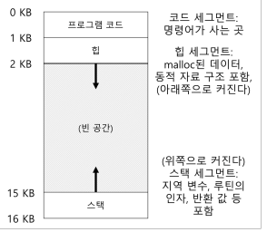

# 주소 공간의 개념

## 16.1 초기 시스템

초기 시스템에서 운영체제는 메모리에 상주하는 루틴(라이브러리)의 집합이었다.

물리 메모리에 운영체제 외 실행 중인 프로그램이 하나 존재했고 이 프로그램이 운영체제가 차지하지 않은 나머지 메모리를 전부 사용했다. 특별한 가상화는 거의 없었다.

## 16.2 멀티프로그래밍과 시분할

### 멀티 프로그래밍 시대

멀티 프로그래밍 시대에는 여러 프로세스가 실행 준비 상태에 있고, 운영체제는 그 프로세스들을 전환하면서 실행했다.

→ CPU 이용률 증가

→ 프로세스 전환에 대한 효율성 개선이 중요한 시대였으며, 시스템 가격은 수십만 또는 수백만 달러나 됐다.

### 시분할 시대

**초기의 엉성한 시분할 시스템**

점점 더 많은 사람들이 컴퓨터를 사용하길 원하게 되면서 시분할 시대가 시작됐다.

- 많은 사람들이 일괄처리방식 컴퓨팅의 한계를 인식했다.
- 현재 실행중인 작업으로부터 즉시 응답할 수 있는 **대화식 이용**의 개념이 중요해졌다.

→ 이를 위해 시분할 시스템을 도입했지만, 초기의 시분할 시스템은 엉성했다. 프로세스가 전환될 때마다 중단 시점의 모든 상태를 디스크 종류의 장치에 저장하고 탑재하길 반복했기 때문이다.

(레지스터 상태를 저장하고 복원하는 것은 빠르지만, 메모리 내용 전체를 디스크에 저장하는 것이 너무 느렸다.)

_⇒ 프로그램을 디스크 같은 매체에 저장해두고 전환 시마다 메모리로 읽어들여 실행시키는 방식_

**개선된 시분할 시스템**

그런 문제를 해결하기 위해 프로세스 전환 시 프로세스를 메모리에 그대로 유지하면서, 운영체제가 시분할 시스템을 효율적으로 구현할 수 있게 개선되었다.

각 프로세스를 모두 물리 메모리에 저장시켜둔 후, 준비 큐로 실행 순서를 관리하기 시작한 것이다.

_⇒ 여러 프로그램을 동시에 물리 메모리에 올려두고, 운영체제가 큐와 스케줄러로만 실행 순서를 관리하는 방식_

**새로운 요구사항**

여러 프로그램이 메모리에 동시에 존재하게 되면서 **보호(protection)** 개념이 중요해졌다.

한 프로세스가 다른 프로세스의 메모리를 읽거나 수정하게 되는 상황을 방지해야 했다.

## 16.3 주소 공간

### 사용하기 쉬운 메모리 개념 (easy to use)

한 프로세스가 다른 프로세스의 메모리를 읽게 되는 위험을 염두하여, easy to use 한 메모리 개념, **주소 공간**이 만들어졌다.

### 주소 공간

주소 공간은 실행 프로그램의 모든 메모리 상태를 갖고 있다.

- 프로그램 코드 (프로그램 명령어)
- 스택 : 함수 호출 체인 상의 현재 위치, 지역 변수, 함수 인자와 반환값 등
- 힙 : 동적으로 할당되는 메모리를 위해 사용됨
- 그 외 기타 등등…

이 중에서 프로그램 코드는 정적이기 때문에(실행 중 추가 메모리를 필요로하지 않음) 주소 공간의 맨 위쪽에 위치한다.

힙은 프로그램 코드 하단에 위치하고, 스택은 주소 공간의 마지막 단에 위치한다. 이 두 공간은 프로그램 실행 중 확장될 수 있으므로 양 끝단에 존재하며 확장될 때마다 안쪽 공간을 할당받는다.

(하지만 스택과 힙의 배치는 관례일 뿐이므로, 주소 공간을 다른 방식으로 배치할 수도 있다.)

물론, 주소 공간의 0번째 주소는 실제 물리 메모리의 0번째 위치를 의미하지 않는다.

운영체제는 하드웨어의 지원을 통해 물리 주소 0이 아닌, 프로세스 A가 탑재된 실제 물리 주소를 읽도록 보장 받아야 한다.

이런 식으로 물리 메모리의 공간이 `easy to use` 하게 구현되는 것이 메모리 가상화의 열쇠이며, 현대 모든 컴퓨터 시스템의 기저를 이루고 있다.

## 16.4 목표

운영체제가 메모리 가상화를 멋지게 해내기 위해서는 몇 가지 목표가 필요하다.

### 1. 투명성 보장

가상 메모리 시스템(VM)의 주요 목표 중 하나는 투명성이다.

운영체제는 실행 중인 프로그램이 가상 메모리의 존재를 인지하지 못하도록 가상 메모리 시스템을 구현해야 한다.

- 프로그램은 전용 물리 메모리를 소유한 것처럼 행동해야 한다.
- 운영체제와 하드웨어가 이를 가능하게 만든다.

### 2. 효율성

운영체제는 가상화가 시간과 공간 측면에서 효율적이도록 해야 한다.

- 시간적 : 프로그램이 너무 느리게 실행되어서는 안된다.
- 공간적 : 가상화를 지원하기 위해 너무 많은 메모리를 사용해서는 안된다.

이를 위해 운영체제는 TLB 등의 하드웨어 기능을 포함하여 하드웨어의 지원을 받아야 한다.

### 3. 보호

운영체제는 프로세스를 다른 프로세스로부터 보호해야 하고, 운영체제 자신도 프로세스로부터 보호해야 한다.

프로세스가 탑재, 저장, 명령어 반입 등을 실행할 때 어떤 방법으로든 다른 프로세스나 운영체제의 메모리 내용에 접근하거나 영향을 줄 수 있어서는 안된다.

- 이러한 보호 성질을 이용하여 프로세스들을 서로 **고립(Isolate)** 시켜야 한다.
- 각 프로세스는 잘못된 혹은 악성 프로세스로부터 안전한 자신만의 보호막 안에서만 실행되어야 한다.
