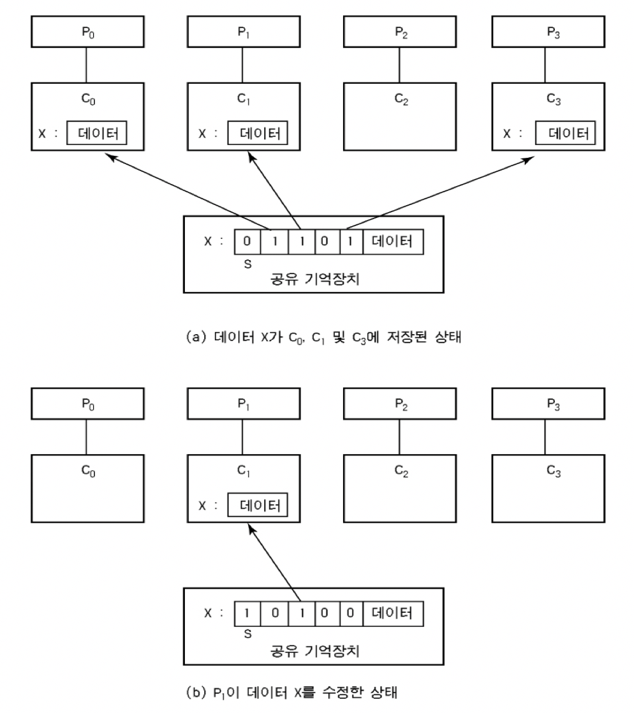
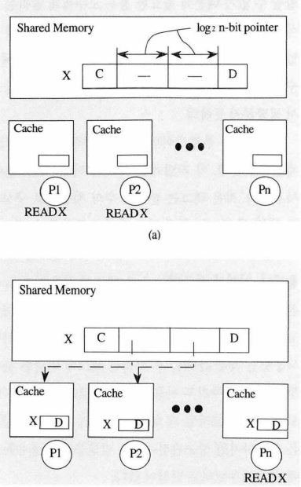
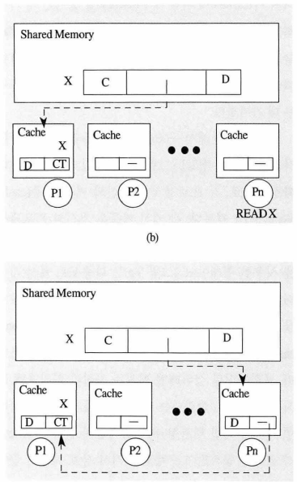

## 17.1 메모리 공간의 종류

C프로그램이 실행되면 두 가지 유형의 메모리 공간이 할당된다.

1. 스택 메모리
   - 할당과 반환은 프로그래머를 위해 컴파일러에 의해 암묵적으로 이루어진다. 이러한 이유 때문에 자동 메모리라고 불리기도 한다.
   - func()가 호출될 때마다 스택에 공간을 확보한다. 리턴되면 컴파일러는 프로그래머 대신 메모리를 반환한다.
   - 즉, 이후에도 유지되어야 하는 정보는 스택에 저장하면 안좋다.
2. 힙 메모리
   - 모든 할당과 반환이 프로그래머에 의해 명시적으로 처리된다.
   - 아래는 정수에 대한 포인터를 힙에 할당하는 예다.
     ```java
     void func() {
     	int *x = (int *) malloc(sizeof(int));
     }
     ```
     - 이 코드에서는 한 행에 스택과 힙 할당이 모두 발생한다.

## 17.2 malloc() 함수

malloc() 호출은 매우 간단하다. 힙에 요청할 공간의 크기를 넘겨주면, 성공했을 경우 새로 할당된 공간에 대한 포인터를 사용자에게 반환하고 실패했을 경우 NULL을 반환한다.

malloc 호출에서는 정확한 크기의 공간을 요청하기 위해 `sizeof` 연산자를 사용한다. c언어에서 sizeof는 통상 컴파일 시간 연산자다. 인자의 실제 크기가 컴파일 시간에 결정된다.

→ 즉, `sizeof()`는 연산자로 간주되는 게 맞으며, 함수 호출이 아니다. (함수 호출은 실행 시간에 일어난다.)

→ 데이터 타입 뿐만 아니라 변수 이름도 `sizeof` 의 인자로 전달할 수 있다.

하지만 다음 경우를 주의하자.

- 아래의 경우 sizeof는 int 참조 변수의 크기 8(64비트 방송) 값을 반환한다.

```java
int *x = malloc(10 * sizeof(int));
printf("%d/n", sizeof(x));
```

- 아래의 경우는 컴파일러가 x의 크기를 알 수 있는 정보가 충훈하다. 따라서 40이 출력된다.

```java
int x[10];
printf("%d/n", sizeof(x));
```

## 17.3 free() 함수

메모리 할당은 우리가 고민하고 있는 문제들 중 쉬운 쪽이다. 할당된 메모리를 언제, 어떻게 해제할 것인지, 여부를 확인하는 것이 더 어려운 문제이다.

더 이상 사용 되지 않는 힙 메모리를 헤제하기 위해 프로그래머는 `free()`를 호출한다.

## 17.4 흔한 오류

malloc()과 free() 를 사용하는 데 흔히 발생하는 오류가 많다.

### 메모리 할당 잊어버리기

많은 루틴은 자신이 호출되기 전에 필요한 메모리가 미리 할당되었다고 가정한다.

`strcpy(dst, src)` 루틴은 소스 포인터에서 목적 포인터로 문자열을 복사한다. 하지만 주의하지 않으면 다음과 같은 코드를 작성한다.

```java
char *src = "hello";
char *dst; // 할당 안 되어 있음
strcpy(dst, src); // 그리고 죽는다.
```

이 코드를 실행하면 세그멘테이션 폴트(segmentation fault)가 발생할 가능성이 높다. 올바른 코드는 다음과 같다.

```java
char *src = "hello";
char *dst = (char*) malloc(strlen(src) + 1);
strcpy(dst, src); // 제대로 동작
```

### 메모리를 부족하게 할당받기

이 오류는 메모리를 부족하게 할당바든 것으로, 때때로 버퍼 오버플로우라고 불린다.

```java
char *src = "hello"
char *dst = (char *) malloc(strlen(src)); // 너무 작다!
strcpy(dst, src); // 제대로 동작
```

이 프로그램은 제대로 동작하는 것처럼 보일 경우가 종종 있다. 어떤 경우에는, 문자열 복사가 실행될 때 할다된 공간의 마지막을 지나쳐 한 바이트 만큼 더 공간을 사용한다.

하지만 이러한 오버플로우는 때로는 매우 유해할 수 있고, 사실 많은 시스템에서 보안 취약점의 원인이다.

### 할당받은 메모리 초기화하지 않기

이 오류는 `malloc()` 을 제대로 호출했지만 새로 할당받은 데이터 타입에 특정 값을 넣는 것을 잊는 것이다.

절대 이러지 말자. 초기화하지 않는다면, 프로그램은 결국 초기화되지 않은 읽기(uninitialized read), 즉 힙으로부터 알 수 없는 값을 읽는 일이 생긴다.

### 메모리 해제하지 않기

다른 일반적인 오류는 **메모리 누수**다. 메모리 헤제를 잊었을 때 발생한다.

장시간 실행되는 응용 프로그램이나 또는 운영체제 자체와 같은 시스템 프로그램에서는 큰 문제이다. 메모리가 천천히 누수되면 결국 메모리가 부족하게 되고 시스템을 재시작 할 수밖에 없기 때문이다.

### 메모리 사용이 끝나기 전에 메모리 해제하기

때때로 프로그램은 메모리 사용이 끝나기 전에 메모리를 해제한다. 그런 실수는 dangling pointer라고 불리며 심각한 실수다.

차후 그 포인터를 사용하면 프로그램을 크래시 시키거나 유효 메모리 영역을 덮어쓸 수 있다.

예를 들어 `free()` 를 호출하고, 그 후 다른 용도로 `malloc()`을 호출하면 잘못 해제된 메모리를 재사용한다.

### 반복적으로 메모리 해제하기

프로그램은 가끔씩 메모리를 한 번 이상 해제하며 이중 해제(double free)라 불린다. 결과는 예측하기 어렵다. 상상할 수 있듯이 메모리 할당 라이브러리는 어찌할 바 모르게 되고, 모든 종류의 이상한 일을 하게 된다.

가장 흔히 일어나는 결과는 크래시다.

### free() 잘못 호출하기

free()는 malloc() 받은 포인터만 전달될 것으로 예상한다. 그 이외의 값을 전달하면 문제가 발생한다.

유효하지 않은 해제는 매우 위험하고 당연히 피해야 한다.

### 요약

메모리를 요용하는 방법은 많다. 메모리 관련 오류가 자주 발생하기 때문에, 코드에서 그런 오류를 찾아내는 도구의 생태계가 생겼다. `purify`와 `vagrind` 를 검토해 보라. 메모리 관련 문제의 원인을 찾아내는 훌륭한 도구들이다.

## 17.5 운영체제의 지원

malloc과 free를 논의해 오면서 시스템 콜에 대해 한 번도 언급하지 않았다. 이유는 간단하다. 이 둘은 시스템 콜이 아니라 라이브러리 함수이기 때문이다.

malloc 라이브러리가 프로세스 가상 주소 공간 안의 공간을 관리하지만 라이브러리 자체는 시스템에게 더 많은 메모리를 요구하고 반환하는 시스템 콜을 기반으로 구축된다.

### brk 시스템 콜

brk는 프로그램의 break 위치를 변경하는 데 사용된다. break는 힙의 마지막 위치를 나타낸다. brk는 새로운 break 주소를 나타내는 한 개의 인자를 받는다.

새로운 break가 현재 break보다 큰 지 작은 지에 따라 힙의 크기를 증가시키거나 감소시킨다.

sbrk는 증가량만을 받아들이는 것을 제외하고 비슷한 용도로 사용된다.

하지만 **brk 또는 sbrk**는 직접 호출해서는 안되며, 메모리 할당 라이브러리에 의해 사용된다.

---

## 발표 : 디렉터리 기반 캐시 일관성 프로토콜

스누핑 기반 캐시 일관성 프로토콜은 캐시나 각 CPU가 시스템 버스를 감시(snooping)하게 하여 변경 신호를 감지하는 방식이었다.

하지만 대규모 멀티 코어 시스템에서는 브로드캐스트 기반인 스누핑 프로토콜은 오버헤드가 커지므로, 정확히 필요한 곳에만 점대점으로 통지해 전역 브로드캐스트를 줄이는 방향의 디렉토리 기반 일관성 방식을 사용하기 시작했다.

- 스누핑 프로토콜은 변경 사항이 생겼을 때 모든 캐시에 신호를 보내고, 신호를 받은 캐시가 자체적으로 자신의 해당 여부를 판단했다. 이러한 방식은 오버헤드가 발생할 수 밖에 없었다.

## 디렉터리 기반 일관성 (Directory-Based Coherence)

- 디렉터리 기반 캐시 일관성 프로토콜은, 공유 메모리에 `디렉터리`라는 자료구조를 두고 각 메모리 블록에 대한 캐시의 상태 정보를 추적하고 관리하는 방식이다.
- 디렉터리는 각 메모리 블록이 어느 캐시에 저장되어 있는 지, 해당 데이터의 상태가 무엇인지를 관리한다.
- 프로세서가 메모리 블록에 접근할 때 디렉터리가 이를 중재하여 캐시 간의 일관성을 유지한다.

### 디렉터리의 구조

**디렉터리 엔트리**가 데이터 블록의 개수 만큼 존재한다.

디렉터리 엔트리는 N개의 비트 수로 이루어져있는 자료구조(비트맵, 비트 벡터, 비트마스크)로, 이 디렉터리 엔트리를 통해 어떤 캐시가 해당 데이터 블록을 복사해놓고 있는 지 추적한다.

디렉터리 엔트리에는 N-bit 외에도 MESI 등의 상태를 저장하는 상태 비트 등이 포함된다.

## 디렉토리 방식 기법

### 풀-맵 디렉토리 기법

풀맵 디렉토리는 디렉토리 엔트리의 정보를 토대로 정확히 필요한 캐시에만 신호를 전달할 수 있도록 한다. 스누핑 프로토콜의 단점을 보완한 디렉토리 방식 기법이다.

디렉터리는 각 데이터 블록마다 코어 수 N에 대응하는 N비트의 비트벡터를 갖는다.



- 주소 X에 대한 읽기 또는 쓰기 작업이 발생했다고 하자.
- 만약 p0과 p1, p3에 순차적으로 읽기를 시도했다면, n-bit의 0, 1, 3번째 비트가 1로 설정되어 해당 캐시에서 X가 공유됐다고 표시한다.
- 이어 P2에서 X에 대해 쓰기를 시도할 경우, 메모리는 자신의 디렉토리를 보고 X를 공유하는 P1과 P2에게 무효화 요청을 보낸 후 디렉토리의 2번째 비트만 1로 설정하고 상태도 modified로 바꾼다.
- 이후 P2는 자신의 캐시에 쓰기를 수행한다.

### 한정 디렉토리 기법

풀-맵 디렉토리 방식은 정확히 필요한 프로세서에게만 신호를 보내서 트래픽을 최소화할 수 있었지만, 디렉터리 저장 공간이 (프로세서 수 X 데이터 블록 수)로 큰 시스템에서는 부담을 줄 수 있었다.

한정 디렉토리 기법은 이에 대한 대안으로 관리할 n-bit의 길이를 상수로 제한을 두었다.

- 풀-맵 디렉토리 기법에서는 각 블록 데이터를 갖고 있는 캐시를 N-bit로 체크했다.
- 하지만 한정 디렉토리는 **특정 블록을 공유하는 캐시가 많지 않은 환경**을 가정한 채, **데이터 블록 당 공유되는 캐시의 수를 상수 K로 제한**한다.
- 때문에 일반적으로 풀맵 디렉토리는 시스템 내 프로세서 수가 N일 때 한 데이터 블록 당 N-bit의 면적이 필요한 반면, 한정 디렉토리 기법은 한 데이터 블록 당 아래의 메모리 면적이 필요하다.
  $$
  K * log_{2}Nbit
  $$
  - 예를 들어 프로세서 수가 8개인 경우 한 데이터 블록 당 필요한 메모리 면적은 3k다.
  - 디렉토리 엔트리 칸 마다 프로세서의 ID를 저장해야하기 때문이다. (000,001,010… 이런 식으로 표기)



### 연결 디렉토리 기법

저장 공간 면적을 줄이면서, 정확히 필요한 프로세서에게만 신호를 전달하고자 하는 목적으로 만들어 진 게 연결 디렉토리 기법이다.
연결 디렉토리에서는 각 디렉터리가 Linked List 로 구성된다.

- 같은 데이터 블록에 대해 공유되는 복사본들이 하나의 연결고리를 형성
- 한정 디렉터리 기법과는 다르게, 각 전용 캐시에 디렉터리가 분산되어 있고, 주 메모리에는 연결고리의 머리 부분을 가리키는 포인터와 상태만 보관한다.
- 요청은 일단 주 메모리로 갔다가 포인터를 통해 연결고리를 따라 필요한 동작이 수행된다.

이런 구조인 이유로, 연결 디렉토리 기법은 연결고리를 구성하는 방법에 따라 **단방향(Single-linked list)와 양방향(Double-linked list)로 구분**된다.

아래는 단방향 연결 디렉터리의 작동 예시다.



- P1이 X에 대한 읽기를 수행할 경우, 공유 메모리의 디렉터리에는 P1에 대한 포인터가 저장된다.
- 이후 Pn이 마찬가지로 X를 읽으면, Pn의 디렉터리가 P1을 가리키게 한 후 헤드 포인터가 Pn을 가리키게 한다. (정확히는 읽기 실패가 발생했을 때 Head로 설정한다. 읽기 성공 시에는 Head 변경 없이 캐시에서 데이터를 바로 읽어오는 게 일반적이다.)
- 쓰기 실행 시에는 기존 연결 고리(공유자들)를 제거하고, 쓰기를 실행한 캐시를 헤드로 등록한다.

연결 디렉터리의 중요한 장점 중 하나는 성능이 풀맵 디렉터리와 비슷하면서도 확장성이 뛰어나다는 것이다. 성능면에서는 단방향보다 양방향이 유리하지만, 연결고리 유지에 드는 메모리가 단방향 방식의 두 배이다.

## 참고 자료

https://notavoid.tistory.com/139

https://butter-shower.tistory.com/40

https://ettrends.etri.re.kr/ettrends/33/0905000968/HJTOCM_1994_v9n3_69.pdf
