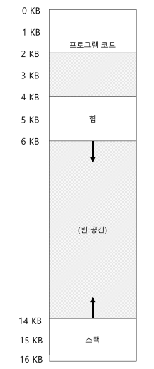
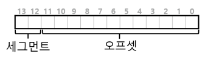
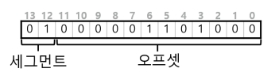
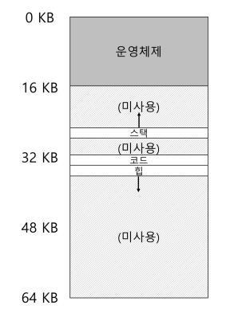

스택과 힙 사이의 공간은 사용되지 않더라도 주소 공간을 물리 메모리에 재배치할 때 물리 메모리를 차지한다.

베이스와 바운드 레지스터 방식은 메모리 낭비가 심하다. 또한, 주소 공간이 물리 메모리보다 클 경우 실행이 매우 어렵다. 이런 측면에서 베이스와 바운드 방식은 유연성이 없다.

## 19.1 세그멘테이션 : 베이스/바운드의 일반화

이 문제를 해결하기 위한 아이디어로 세그멘테이션이 있다.

아이디어는 간단하다. MMU 안에 오직 하나의 베이스와 바운드 쌍만 존재하는 것이 아니라 주소 공간의 논리적인 세그멘트 마다 베이스와 바운드 쌍이 존재한다.

세그멘트는 특정 길이를 가지는 연속적인 주소 공간이다. 우리가 기준으로 삼은 주소 공간는 코드, 스택 및 힙 세 종류의 세그멘트가 있다.

세그멘테이션을 사용하면 운영체제는 각 세그멘트를 물리 메모리의 각기 다른 위치에 배치할 수 있고, 사용되지 않는 가상 주소 공간이 물리 메모리를 차지하는 것을 방지할 수 있다.

가상주소를 물리 주소로 계산하는 방법은 다음과 같다.

### 가상 → 물리 주소 변환

아래와 같은 프로그램의 주소 공간을 물리 공간에 배치한다고 가정한다.

1. 가상 주소 100번지의 물리 주소

- 가상 주소 100번지는 프로그램 코드(2KB = 2024 Byte)에 속한다.
- 참조가 일어나면 하드웨어는 베이스 값에 이 세그먼트의 오프셋(100)을 더한다.
- 물리 메모리의 코드 베이스는 32kb이며 크기는 2kb이다.
- 따라서, 32kb + 100 = 32 \* 1024byte + 100 = 32868 이다.
- 가상주소 100에 접근해 읽을 경우, 100은 코드 세그먼트 크기 2kb보다 작으므로, 32868에서 데이터를 읽게 된다.

1. 가상 주소 4200번지의 물리 주소

- 4200번지는 주소 공간의 힙 영역에 속한다. (4kb = 4096byte)
- 힙 영역은 4096번지부터 시작하므로, 4200번지의 오프셋은 `4200-4096 = 104` 가 된다.
- 나머지 계산법은 100번지 일때와 똑같다.

1. 만약 힙의 마지막을 벗어난 7kb 와 같은 잘못된 주소로 접근하려고 할 경우

- 이 경우에는 하드웨어가 해당 주소가 범위를 벗어났다는 것을 감지하여 운영체제에 트랩을 발생시킨다.
  - 운영체제는 프로세스를 종료시킬 가능성이 크며, 이게 바로 세그먼트 위반 또는 세그먼트 폴트라고 불리는 현상이다.



## 19.2 세그먼트 종류의 파악

하드웨어는 변환을 위해 세그먼트 레지스터를 사용한다. 하드웨어는 가상 주소가 어느 세그먼트를 참조하는 지 그리고 그 세그멘트 안에서 오프셋은 얼마인지를 어떻게 알 수 있을까?

### 첫 번째 방법

첫 번째로, 가상 주소의 최상위 몇 비트를 기준으로 주소 공간을 여러 세그먼트로 나누는 방법이 있다. 위의 예에서는 3개의 세그먼트(힙, 스택, 코드 공간)가 있다.

주소 공간을 세그멘트로 나누기 위해서는 2비트가 필요하다. 세그멘트를 표시하기 위해 가상 주소 14비트 중 최상위 2비트를 사용하는 경우 가상 주소의 모양은 다음과 같이 보일 것이다.



그리고 가상 주소 4200에 해당하는 이진 형식은 다음과 같다.



- 그림에서 볼 수 있듯이, 최상위 2비트(01)는 하드웨어에게 참조하는 세그멘트의 종류를 알려준다. 하위 12비트는 세그멘트 내의 오프셋이다. (`0000 0110 1000` = 10진수 104)
- 하드웨어는 세그멘트 레지스터를 파악하는 데 처음 2비트를 이용하고, 세그멘트 오프셋으로 다음 12비트를 취한다. 오프셋에 베이스 레지스터 값을 더하여 하드웨어는 최종 물리 주소를 계산한다.
- 오프셋은 바운드 검사도 쉽게 만든다. 오프셋이 바운드보다 작은지 여부만 검사하면 된다.

다만, 해당 방식은 세그먼트를 구별하기 위해 2비트를 쓰지만 세그멘트는 세 개만 존재하기 때문에(코드, 힙, 스택) 하나의 세그멘트는 미사용으로 남게 된다.

이를 해결하기 위해 일부 시스템은 코드와 힙을 하나의 세그멘트에 저장하고 세그멘트 선택을 위해 1비트만 사용하기도 한다.

### 두 번째 방법

특정 주소의 세그멘트를 하드웨어적으로 파악하는 다른 방법에는 **묵시적 접근** 방식이 있다.

이 접근 방식에서는 주소가 어떻게 형성되었나를 관찰하여 세그멘트를 결정한다.

예를 들어, 주소가 프로그램 카운터에 생성되었다면 주소는 코드 세그멘트 내에 있을 것이다.

주소가 스택 또는 베이스 포인터에 기반을 둔다면 주소는 스택 세그멘트 내에 있다.

다른 주소는 모두 힙에 있어야 한다.

## 19.3 스택

아래 그림에서 스택은 물리 주소 28KB에 배치돼있지만 다른 두 세그먼트와는 주요한 차이가 있다. 바로 **다른 세그멘트들과 달리 반대 방향으로 확장된다**는 것이다.

물리 메모리 28kb에서 시작해 26kb까지 차지한다. 가상 주소에서도 마찬가지로 반대 방향으로 확장된다.

즉, 다른 방식의 주소 변환이 필요하다.



첫 번째로, 간단한 하드웨어가 추가로 필요하다. 베이스와 바운드 값 뿐만 아니라 하드웨어는 세그멘트가 어느 방향으로 확장하는지도 알아야 한다.

### 가상 주소 15KB에 접근한다고 가정 (주소 공간 19.1 그림 참조)

가상 주소 15KB에 접근하려 할 때, 이 주소는 물리 주소 27KB에 매핑되어야 한다. 이 가상 주소를 이진 형태로 바꾸면 `11 1100 0000 0000` 이 된다.

하드웨어는 상위 2비트(11)를 사용해 세그멘트를 지정한다. 이를 고려하면 3KB의 오프셋이 남는다. 하지만 올바른 음수 오프셋을 얻기 위해 세그멘트 최대 크기를 빼야 한다.

즉, `3-4kb` = `-1kb` 가 최종 오프셋이 된다. 이제 베이스 28kb에 -1kb를 더하면 올바른 물리 주소인 27k를 얻을 수 있다.

## 19.4 공유 지원

세그멘테이션 기법이 발전함에 따라 시스템 설계자들은 간단한 하드웨어 지원으로 새로운 종류의 효율성을 성취할 수 있다는 것을 깨달았다.

- 메모리를 절약하기 위해 때로는 주소 공간들 간에 특정 메모리 세그멘트를 공유하는 것이 유용.
  - 특히 코드 공유가 일반적이며, 현재 시스템에서도 광범위하게 사용 중이다.

공유를 지원하기 위해 하드웨어에 protection bit 추가가 필요하다. 세그멘트마다 protection bit를 추가해 세그멘트를 읽거나 쓸 수 있는지, 혹은 세그맨트의 코드를 실행시킬 수 있는지를 나타낸다.

코드 세그멘트를 읽기 전용으로 설정하면 주소 공간의 독립성을 유지하면서도 여러 프로세스가 주소 공간의 일부를 공유할 수 있다.

각 프소세스는 여전히 자신의 전용 메모리를 사용하고 있다고 생각하지만, 운영체제는 이 변경이 불가능하도록 설정된 메모리 영역을 비밀리에 공유시켜 그러한 환상을 유지토록 한다.

protection bit를 사용하면 앞서 언급한 하드웨어 알고리즘이 수정되어야 한다. 가상 주소가 범위 내에 있는지 확인하는 것 이외에 특정 엑세스가 허용되는지를 확인해야하기 때문이다.

- 사용자 프로세스가 읽기 전용 페이지에 쓰기를 시도하는 경우 또는 실행 불가 페이지에서 실행하려고 하면 하드웨어는 예외를 발생시켜 운영체제가 위반 프로세스를 처리할 수 있게 해야 한다.

## 19.5 소단위 대 대단위 세그멘테이션

그간 살펴본 예제는 소수의 세그멘트(즉, 코드, 스택, 힙)만을 지원하는 시스템에 초점을 맞추고 있었다.

이 세그멘테이션은 **대단위(=coarse-grained)**라고 생각할 수 있다. 주소 공간을 비교적 큰 단위의 공간으로 분할하기 때문이다.

하지만 일부 초기 시스템은 주소 공간을 작은 크기의 공간으로 잘게 나누는 것이 허용되었기 때문에, **소단위(fine-grained)** 세그멘테이션이라고 부른다.

많은 수의 세그멘트를 지원하기 위해서는 여러 세그멘트 정보를 저장할 수 있는 세그멘트 테이블 같은 하드웨어가 필요하다. 세그멘트 테이블을 이용하면 매우 많은 세그멘트를 손쉽게 생성하고 융통성 있게 사용할 수 있다.

- 이 소단위 세그멘트 아이디어는 소단위로 세그멘트를 관리하는 것이 운영체제가 사용하는 세그멘트와 미사용 세그멘트를 구분하여 메모리를 더 효육적으로 활용할 수 있다는 게 핵심이었다.

## 19.6 운영체제의 지원

시스템이 각 주소 공간 구성 요소를 별도로 물리 메모리에 재배치하기 때문에, 전체 주소 공간이 하나의 베이스-바운드 쌍을 가지는 간단한 방식에 비해 물리 메모리를 엄청나게 절약할 수 있다.

하지만 세그멘테이션은 새로운 문제를 제기한다.

1. 문맥 교환 시 운영체제는 어떤 일을 해야 하는가
   - 세그멘트 레지스터를 저장 및 복원해야 한다. 각 프로세스는 자신의 가상 주소 공간을 가지며, 운영체제는 프로세스를 다시 실행하기 전에 레지스터들을 올바르게 설정해야 한다.
2. 미사용 중인 물리 메모리 공간 관리
   - 새로운 주소 공간이 생성되면 운영체제는 이 공간의 세그멘트를 위한 비어있는 물리 메모리 영역을 찾을 수 있어야 한다.
   - 그동안 우리는 각 주소 공간의 크기가 동일하다고 가정했다. 하지만 지금은 프로세스가 많은 세그멘트를 가질 수 있고, 각 세그멘트는 크기가 다를 수 있다.

일반적으로 생길 수 있는 문제는 물리 메모리가 작은 크기의 빈 공간들로 채워지는 경우이다. 이 작은 빈 공간들은 새로이 생겨나는 세그멘트를 할당하기가 힘들 뿐더러 기존 세그멘트를 확장하는 데에도 어려움이 있다.

- 이 문제가 바로 **외부 단편화**이다.

### 외부 단편화 해결하기

1. 압축

이 문제를 해결할 수 있는 한 가지 방법은 세그멘트를 정리하여 물리 메모리를 압축하는 것이다.

- 현재 실행 중인 프로세스를 중단하고, 기존 데이터를 연속된 공간에 복사하고, 세그멘트 레지스터가 새로운 물리 메모리 위치를 가리키게 한다.

하지만 세그멘트 복사는 메모리에 부하가 큰 연산이며 일반적으로 시간이 오래 걸리기 때문에 비용이 많이 든다.

2. 빈 공간 리스트 관리 알고리즘 사용

간단한 방법으로, 빈 공간 리스트를 관리하는 알고리즘을 사용하는 것이 있다. 빈 공간 관리 알고리즘은 할당 가능한 메모리 영역들을 리스트 형태로 유지한다.

최적 적합, 최악 적합, 최초 적합, 버디 알고리즘 등의 고전적인 알고리즘들이 모두 이 방식에 해당한다.

물론 알고리즘이 아무리 정교해도 외부 단편화는 어쩔수 없이 존재하며, 모든 빈 공간 리스트 알고리즘은 외부 단편화를 최대한 줄이는 것을 목표로 한다.

---

# 발표 : 세그먼트 폴트가 발생하는 경우

## Segment Fault란?

프로그램이 액세스가 허용되지 않은 메모리 위치에 엑세스하려고 하거나, 허용되지 않은 방식으로 메모리 위치에 엑세스하려고 할 때 발생한다.

- 존재하지 않는 세그먼트를 참조하거나, 세그먼트 경계 밖의 위치를 참조하거나, 해당 세그먼트에 부여된 권한에서 허용하지 않는 방식으로 위치를 참조하려는 시도를 감지하면 세그멘테이션 오류가 발생한다.
  - 운영체제의 일부를 덮어쓰려고 하는 경우
  - 읽기 전용 메모리 위치에 쓰기 작업을 실행하려고 하는 경우

## Segment Fault 발생 순서

- 하드웨어 수준에서는, MMU가 가상 주소에 접근하는 중 불법적인 접근이거나, 참조 주소가 존재하지 않아 유효하지 않을 경우 페이지 폴트가 발생해 커널로 트랩한다.
- 이후 복구가 불가능할 경우, 운영 체제 수준에서는 커널이 프로세스에 신호를 전달하여 해당 신호에 대한 핸들러를 실행하거나 동작을 중지한다.
  - 운영체제마다 세그멘테이션 오류가 발생했음을 나타내는 신호가 다르다.
    - Unix 계열에서는 `SIGSEGV`, Window에서는 `STATUS_ACCESS_VIOLATION` 예외를 수신

## Segment Fault의 원인

일반적인 원인은 다음과 같다.

- 존재하지 않는 메모리 주소(프로세스 주소 공간 외부)에 액세스하려고 시도
- 프로그램이 권한이 없는 메모리에 액세스하려고 시도 (ex. 프로세스 컨텍스트의 커널 구조)
- 읽기 전용 메모리(ex. 코드 세그먼트)에 쓰려고 시도

또한, 잘못된 메모리 엑세스를 시도하는 프로그래밍 오류로 발생하는 경우도 많다.

- 프로세스 주소 공간의 일부가 아닌 주소를 가리키는 널 포인터에 역참조 하는 경우
  - c에서 정수 상수 0을 포인터로 변환하면 널 포인터가 된다.
  - 널 포인터는 어떤 유효한 객체도 가리키지 않는다는 언어 차원의 규약이고, 대부분의 OS는 주소 0을 접근 불가로 두고 있어 세그먼트 폴트가 발생한다.

```java
int* ptr = (int*) 0x00000000; // int* ptr = NULL 도 같은 의미
*ptr = 1;
```

- 초기화되지 않은 포인터(와일드 포인터)에 대한 역참조 또는 할당
  - 초기화되지 않은 포인터에는 대부분 쓰레기 값이 들어가있어, 매핑되지 않은 주소를 가리키거나 읽기 전용 혹은 커널 영역을 가리키게 된다.

```java
int *p; // 쓰레기 값
*p = 123; // 와일드 포인터 역참조
```

- 해제된 포인터(댕글링 포인터)에 대한 역참조 또는 할당

```java
int *p = malloc(sizeof *p);
*p = 42; // OK (아직 유효)
free(p); // 메모리 해제하여 댕글링 포인터가 됨

*p = 7;  // 해제된 메모리에 할당

// 아래와 같은 경우도 해당됨
int* bad() {
    int x = 10;   // 스택 변수
    return &x;    // 스코프 벗어나면 무효 (댕글링)
}
int main(void) {
    int *p = bad(); // 댕글링 포인터
    *p = 123;       // 스택 영역의 더 이상 유효하지 않은 주소에 쓰기 → UB
                    // 즉시 세그폴트 or 조용한 스택 손상
    return 0;
}
```

- 읽기 전용 메모리에 쓰기를 시도하는 경우

```java
const char *s = "hello world";
*s = 'H';
```

- 버퍼 오버플로우 : 메모리가 다른 중요한 영역을 침범

```java
char s[] = "hello world"
char c = s[20000];
```

- 스택 오버플로우 : 스택이 메모리의 다른 영역을 침

```java
int main(void) {
	return main();
}
```

## 참고 자료

https://duddn.tistory.com/38

https://en.wikipedia.org/wiki/Segmentation_fault
