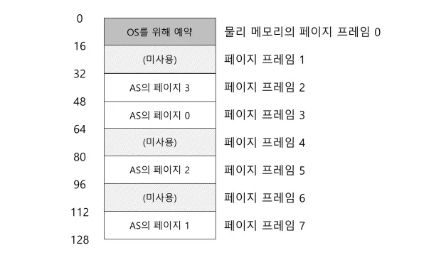
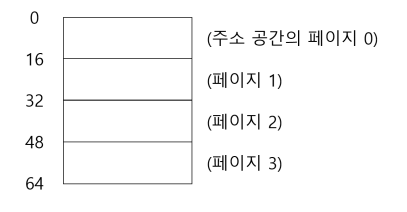
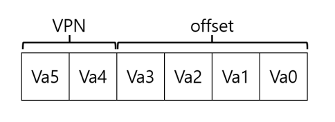
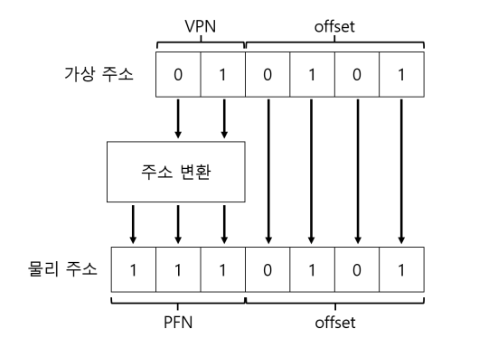
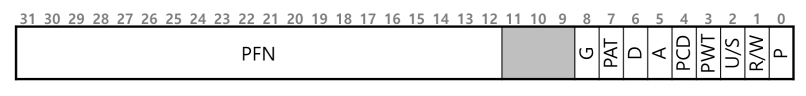
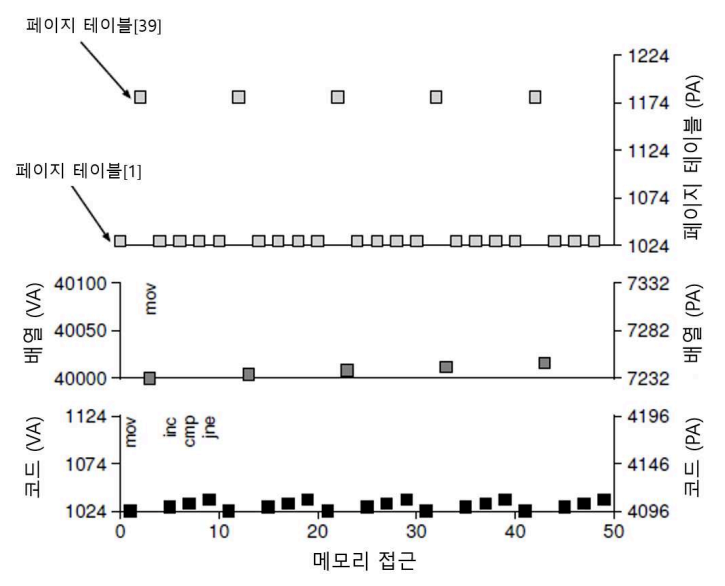

# 21. 페이징 : 개요

운영체제는 거의 모든 공간 관리 문제를 해결할 때 두 가지 중 하나를 사용한다.

1. 가변 쿠기의 조각들로 분할하는 것 (세그먼트 방식)

- 하지만 이 해결책은 공간을 다양한 크기의 청크로 분할할 때 공간 자체가 **단편화될 수 있다는 단점이 있다.**

2. 공간을 동일 크기의 조각으로 분할하는 것

- 이 방법을 가상 메모리에서는 **페이징**이라고 부른다.
- 프로세스의 주소 공간을 몇 개의 가변 크기의 논리 세그멘트로 나누는게 아니라, 고정 크기의 단위로 나눔.
- 각각의 고정 크기 단위를 페이지라고 부른다. (상응하여, 물리 메모리도 **페이지 프레임**이라 불리는 고정 크기의 슬롯 배열이라고 생각한다.
  - 이 프레임 각각은 하나의 가상 메모리 페이지를 저장할 수 있다.

> [!NOTE]페이지를 사용하여 어떻게 메모리를 가상화 할 수 있을까?
>
> - 세그멘테이션의 문제점을 해결하기 위해 페이지를 사용하여 어떻게 메모리를 가상화할 수 있는가?

## 21.1 간단한 예제 및 개요

페이징은 세그멘테이션에 비해 많은 장점을 가지고 있다.

- 유연성 : 프로세스의 주소 공간 사용 방식과는 상관없이 효율적으로 주소 공간 개념을 지원할 수 있다.
  - ex) 힙과 스택이 어느 방향으로 커지는가, 어떻게 사용되는가에 대한 가정을 하지 않아도 됨
- 빈 공간 관리가 단순함 : 단편화를 신경쓰지 않고 필요한 개수 만큼의 비어있는 페이지만 찾으면 된다.
  - 이를 위해 운영체제는 모든 비어 있는 페이지의 **빈 공간 리스트**를 유지하고, 리스트의 첫 n개 페이지를 선택할 것이다.
  - ex) 64 Byte 4페이지(페이지 당 16 Byte) 라고 가정한 주소 공간을 각 페이지가 16 Byte인 8 페이지의 물리 메모리(총 128 Byte)에 배치하기를 원한다고 할 때, 운영체제는 물리 메모리에서 비어있는 네 개의 페이지만 찾으면 된다.

### 페이지 테이블

운영체제는 주소 공간의 각 가상 페이지에 대한 물리 메모리 위치 기록을 위해 프로세스마다 **페이지 테이블(Page Table)**이라는 자료 구조를 유지한다.

페이지 테이블의 주요 역할은 **주소 공간의 가상 페이지 주소 변환 정보를 저장**하는 것이다.

- 각 페이지가 저장된 물리 메모리의 위치가 어디인지 알려준다.
- 아래 예제의 경우, 페이지 테이블은 다음과 같은 항목을 가지게 될 것이다.
  - VP(가상 페이지) 0 → PF(물리 프레임) 3
  - VP 1 → PF 7
  - VP 2 → PF 5
  - VP 3 → PF2



페이지 테이블은 프로세스마다 존재한다는 사실을 숙지해야 한다.

위의 예에서 다른 프로세스를 실행해야 한다면, 운영체제는 이 프로세스를 위한 다른 페이지 테이블이 필요하다.

### 간단한 예제



위의 그림과 같은 64 Byte 의 주소 공간을 가진 프로세스가 다음 메모리에 접근한다고 가정하자.

```java
movl <virtual address>, %eax
// 주소 <virtual address>의 데이터를 eax 레지스터에 탑재하는 데에 집중한다.
// 명령어 반입 단계는 일단 무시
```

프로세스가 생성한 가상 주소의 변환을 위해 먼저 가상 주소를 **가상 페이지 번호(virtual page number, VPN)**와 페이지 내의 **오프셋** 2개로 구성된 요소로 분할한다.

- 위 예에서는 가상 주소 공간의 크기가 64 Byte 이므로 가상 주소는 6bit가 필요하다.
  - `2의 6승 = 128`

가상 주소를 개념적으로 아래 그림처럼 생각할 수 있다. Va5는 가상 주소의 최상위 비트, Va0은 최하위 비트를 나타낸다.

- 우리는 전체 64 Byte 주소 공간에서 페이지 당 크기가 16 Byte라고 정해 놨기 때문에 네 페이지를 선택할 수 있어야 한다. 따라서 주소의 최상위 2비트가 페이지를 구분하는 역할을 한다. (2의 2승 = 4)
- 앞의 2비트는 VPN으로 가상 페이지 번호를, 뒤의 4비트는 오프셋으로 페이지 내에서 우리가 원하는 바이트의 위치를 나타낸다.



프로세스가 가상 주소를 생성하면, 운영체제와 하드웨어가 의미있는 물리 주소로 변환한다.

예를 들어 위 탑재 명령어의 가상 주소가 21이라고 하자.

```java
movl 21, %eax
```

21을 이진 형식으로 변환하면 `010101`이다. 앞의 `01` 이 VPN, 뒤의 `0101` 이 오프셋이 된다.

즉, `가상 페이지 01의 5(0101)번째 바이트`를 가리킨다.

이 가상 페이지 번호를 가지고 페이지 테이블의 인덱스로 사용하여 가상 페이지 1이 어느 물리 프레임에 저장돼있는 지 찾을 수 있는 것이다.

위 예에서 가상 페이지 01이 탑재된 물리 프레임 번호(=물리 페이지 번호)는 7(이진수111)이다.

- 페이지 테이블 파트에서 우리는 페이지 테이블에 `VP 1 → PF 7` 로 저장돼있는 상태를 가정했다.

VPN을 PFN(=PPN)으로 교체하여 가상 주소를 물리 주소로 최종 변환하게 된다.

- `01 0101 -> 111 0101 (십진수 117)`
- 오프셋은 페이지 내에서의 구체적인 위치를 알려주기 때문에 변하지 않는다.



## 21.2 페이지 테이블은 어디에 저장되는가

페이지 테이블은 세그멘트 테이블이나 베이스-바운드 쌍에 비해 커질 수 있다.

- 예를 들어 4kb(=4096byte =2의 12승) 크기의 페이지를 가지는 전형적인 32비트 주소 공간을 상상해보자. 이 가상 주소는 20비트 VPN과 12비트 오프셋으로 구성된다.

20비트 VPN은 운영체제가 각 프로세스를 위해 관리해야 하는 변환의 개수가 `2의 20승`임을 의미한다.

물리 주소로의 변환 정보 외 다른 필요한 정보(하단에서 어떤 정보들이 있는 지 설명한다.)도 저장하기 위해 PTE마다 4바이트가 필요하다고 가정한다면, 각 페이지 테이블을 저장하기 위해 필요한 전체 메모리 크기는 약 4mb 가량이 된다. 이는 상당히 큰 크기다.

- 프로세스 100개가 실행 중이면 주소 변환만을 위해 운영체제에서 400mb의 메모리를 필요로 한다는 것이다.

## 21.3 페이지 테이블에는 실제 무엇이 있는가

페이지 테이블 구성에 대해 살펴보자.

페이지 테이블은 가상 주소를 물리 주소로 매핑하는 데 사용되는 자료구조다.

가장 간단한 형태의 페이지 테이블은 **선형 페이지 테이블(linear page table)**이다. (단순 배열이다.)

운영체제는 원하는 물리 프레임 번호(PFN)를 찾기 위해 가상 페이지 번호(VPN)로 배열의 항목에 접근하고 그 항목의 페이지 테이블 항목(PTE)을 검색한다.

각 PTE에는 심도있는 이해가 필요한 비트들이 존재한다.

- Valid bit : 특정 변환의 유효 여부를 나타내기 위해 포함됨
  - 예를 들어, 프로그램이 실행을 시작할 때 코드와 힙이 주소 공간의 한쪽에 있고 반대쪽은 스택이 차지하고 있을 것이다. 그 사이의 모든 공간은 무효(invalid)로 표시되고, 프로세스가 그런 메모리에 접근하려고 하면 운영체제에서 트랩을 발생시킨다.
  - valid bit는 할당되지 않은 주소 공간을 표현하기 위해 반드시 필요하다. (미사용 페이지를 모두 표시함으로써 이러한 페이지들에게 물리 프레임을 할당할 필요를 없애 메모리를 절약)
- protection-bit : 페이지를 읽을 수 있는 지, 쓸 수 있는 지, 또는 실행될 수 있는 지를 표시.
  - Protection bit가 허용하지 않는 방식으로 페이지에 접근하려고 하면 운영체제에서 트랩을 생성
- present-bit : 이 페이지가 물리 메모리에 있는 지 혹은 디스크에 있는지(즉, 스왑 아웃 됐는지)를 가리킴
  - 이 비트는 물리 메모리가 더 큰 주소 공간을 지원하기 위해 주소 공간의 일부를 스왑하는 방법과 관련이 있다.
  - 스와핑은 운영체제가 드물게 사용되는 페이지를 디스크로 이동시켜 물리 메모리를 비울 수 있게 한다.
- dirty-bit : 메모리에 반입된 후 페이지가 변경됐는지 여부를 나타낸다.
- reference bit : 때때로 페이지가 접근됐는지를 추적하기 위해 사용됨. 또한, 어떤 페이지가 인기가 있는 지 결정하여 메모리에 유지돼야 하는 페이지를 결정하는 데에도 유용. (페이지 교체와 관련 있다.)

아래 그림은 x86 아키텍처의 **페이지 테이블 항목**을 보여준다.



- Present bit (P)
- 읽기/쓰기 bit (R/W) : 이 페이지에 쓰기가 허용되는가
- 사용자/슈퍼바이저 bit (U/S) : 사용자 모드 프로세스가 페이지에 액세스 할 수 있는가
- PWT, PCD, PAT 및 G : 이 페이지에 대한 하드웨어 캐시의 동작을 결정하는 몇몇 비트들
- reference bit (A)
- dirty bit (D)
- PFN : 물리 페이지 프레임 번호 자체

## 21.4 페이징 : 너무 느림

페이지 테이블의 크기가 메모리 상에서 매우 크게 증가할 수 있어, 이로 인해 처리 속도가 저하될 수 있다.

다시 한번 아래 명령어를 예로 들어보자.

```java
movl 21, %eax
// 주소 21에 대한 참조만 고려하고 명령어 반입에 대해서는 고려 X하기로 가정
```

원하는 데이터를 가져 오기 위한 절차는 다음과 같다. (당분간 하나의 페이지 베이스 레지스터가 페이지 테이블의 시작 주소(물리)를 저장한다고 가정한다.)

1. 프로세스의 페이지 테이블에서 적절한 페이지 테이블 항목을 가져온다.
2. 가상 주소 21을 물리주소 117로 변환한다.
3. 물리 메모리에서 데이터를 탑재한다.

위 1번 과정에서 더 구체적으로, MMU는 원하는 PTE의 위치를 찾기 위해 다음과 같은 연산을 수행한다.

```java
VPN = (VirtualAddress & VPN_MASK) >> SHIFT
PTEAddr = PageTableBaseRegister + (VPN * sizeof(PTE))
```

- 이 예제에서 VPN_MASK는 `0x30(16진수 30 또는 이진수 110000)` 으로 설정되고, 전체 가상 주소에서 **VPN 비트만 골라내는 역할**을 한다.
  - SHIFT는 4로 설정(오프셋 비트 수)되고, 올바른 정수 가상 페이지 번호를 형성하기 위해 VPN 비트를 오른쪽으로 이동시킨다.
    - `(VirtualAddress & VPN_MASK)` ⇒ 010000
    - `010000 >> SHIFT` ⇒ 000001
- 이 값을 페이지 테이블 베이스 레지스터가 가리키는 PTE 배열에 대한 인덱스로 사용하여 PTE 위치를 차찾는다.
  - `PageTableBaseRegister + (VPN * sizeof(PTE))`
  - PageTableBaseRegister는 페이지 테이블의 주소 공간 시작 주소를 담고 있고, 여기서 가정한 페이지 테이블 구조는 선형 구조이다. 따라서 여기에 VPN\*(PTE의 개당 사이즈)를 더하면 원하는 PTE를 찾을 수 있게 된다.

이렇게 찾은 PTE에는 위 페이지 테이블 구조에서 보았듯 PFN이 저장돼있다. 이를 통해 물리 메모리의 몇 번 페이지에 원하는 데이터가 저장돼있는 지 알 수 있고, 가상 주소의 오프셋과 연결하여 원하는 최종 물리 주소를 얻을 수 있다.

- PFN을 `SHIFT` 값 만큼 왼쪽으로 쉬프트하고, 오프셋과 논리적 OR 연산을 하여 최종 주소를 형성

```java
offset = VirtualAddress & OFFSET_MASK
PhysAddr = (PFN << SHIFT) | offset
```

이렇게 페이지 테이블을 통해 가상 주소를 물리 주소로 무사히 변환했으면 이제 메모리에서 원하는 데이터를 가져와 eax 레지스터에 넣을 수 있다. 이제 프로그램은 메모리로부터 값을 성공적으로 탑재했다!

하지만 이러한 과정은 모든 메모리 참조에 대해 먼저 페이지 테이블에서 변환 정보를 반입해야하기 때문에, 반드시 한 번의 추가적인 메모리 참조가 필요하다. 메모리 참조는 비용이 비싸고, 이 경우에 프로세스는 2배 이상 느리다.

페이징이 메모리 가상화에 필요한 훌륭한 해결책이기 위해서는 아래 두 가지 문제를 해결해야 한다.

- 하드웨어와 소프트웨어의 신중한 설계 없이는 페이지 테이블로 인해 시스템이 매우 느려질 수 있다.
- 더불어, 같은 이유로 너무 많은 메모리를 차지할 수 있다.

## 21.5 메모리 트레이스

간단한 메모리 엑세스 예를 통해 페이징을 사용했을 때 발생하는 모든 메모리 접근을 살펴보자.

예제는 다음과 같다.

```java
// array.c 의 C언어로 작성된 코드
int array[1000];
...
for (i = 0 ; i < 1000 ; i++)
	array[i] = 0;

// 위 프로그램을 실행시킨다.
prompt> gcc −o array array.c −Wall −O
prompt> ./array
```

먼저, 루프 안에서 배열을 초기화하기 위해 어떤 어셈블리 명령어를 사용하는 지 확인해야 한다. 이를 위해 결과 이진 파일을 디스어셈블하게 된다.

이에 대한 결과 어셈블리 코드는 다음과 같다.

```java
0x1024 movl $0x0, (%edi,%eax,4)
// 값(0)을 가상 메모리 주소로 옮김.
// 0 값이 저장될 가상 메모리 주소는 %edi의 값을 %eax의 4배에다 더해서 계산
// (edi는 배열의 시작 주소를, eax는 배열 인덱스를 저장)
// (정수 배열이기 때문에 4를 곱한 것)
0x1028 incl %eax
// %eax에 저장된 배열 인덱스를 증가시킴
0x102c cmpl $0x03e8,%eax
// %eax의 값과 16진수 0x03e8(십진수 1000)을 비교.
0x1030 jne 0x1024
// 비교 결과 아직 두 값이 같지 않다면(jne 명령어가 검사한다.),
// 해당 명령어에서 루프의 상단으로 다시 분기됨.
```

이 예는 크기가 64 KB인 가상 주소 공간을 가정한다. 또, 페이지 크기는 1KB로 가정한다. 선형 페이지 테이블이고, 물리 주소 1KB에 위치한다고 가정하자.

이 예에서 신경써야 할 몇 개의 페이지 테이블이 있다.

1. 코드가 상주하는 가상 페이지
   - 페이지 크기가 1KB이기 때문에 가상 주소 1024는 가상 주소 공간의 두 번째 페이지(VPN=1)에 상주한다.
   - 이 가상 페이지가 물리 프레임 4에 매핑된다고 가정하자. (`VPN 1 → PFN 4`)
2. 배열
   - 크기는 4000바이트(1000개의 정수)이고, 가상 주소 40000에서 43999까지 존재한다고 가정한다.
   - 이 범위에 해당하는 가상 페이지는 VPN 39…VPN=42이다. 이 가상-물리 주소 매핑이 다음과 같다고 가정하자
     - (VPN 39 → PFN7), (VPN 40 → PFN 8), (VPN 41 → PFN 9), (VPN 42 → PFN 10).

### 프로그램 살펴보기

이제 위 프로그램의 메모리 참조를 살펴보자.

프로그램이 실행되면 각 명령어의 반입 시 메모리가 두 번 참조한다.

- 명령어의 위치를 파악하기 위해 페이지 테이블 접근 한 번
- 명령어 자체에 한 번

mov 명령어도 페이지 테이블 접근 한 번, 다음 배열 자체를 접근하기 위하여 한 번의 참조가 필요하다.

처음 다섯 번의 루프 반복에 대한 전체 과정을 그림으로 표현하면 다음과 같다.



- 가장 아래쪽 그래프가 명령어의 메모리 참조고, 중앙의 그래프는 배열에 대한 접근, 그리고 맨 위 그래프는 페이지 테이블 메모리 접근이다.

이처럼 루프 당 10번의 메모리 접근이 존재한다.

## 21.6 요약

페이징 방식의 장점은 다음과 같다.

- 메모리를 고정 크기 단위로 나누며, 가상 주소 공간의 드문 사용을 허용한다.
  - 가상 주소 공간 내 안 쓰는 영역을 허용한다는 의미

하지만 위에서 살펴봤듯, 페이징은 제대로 구현하지 못하면 컴퓨터가 매우 느려지고 뿐만 아니라 메모리 낭비 까지 초래한다.

제대로 동작하는 페이징 시스템을 만들기 위해서는 더 많은 노력이 필요하며, 이에 대해서는 다음 장에 알아본다.

---

---

# 추가 학습

## 32bit 운영체제는 왜 x86로 표기할까?

- x86은 32비트라는 뜻이 아니라, 8086 계열의 운영체제라는 의미이기 때문.
- 원래 인텔 CPU 이름은 다음과 같이 나왔었다.
  - 8086
  - 80186
  - 80286
  - 80386
  - 80486
  - …
- 보다시피 뒤가 전부 86으로 끝났기 때문에, 이 계열을 전부 통칭해서 x86이라 불렀다.
- x64의 공식 아키텍쳐 이름은 `x86-64` 또는 `AMD64` 다. 이를 줄여서 x64라고 부르는 것이다.
